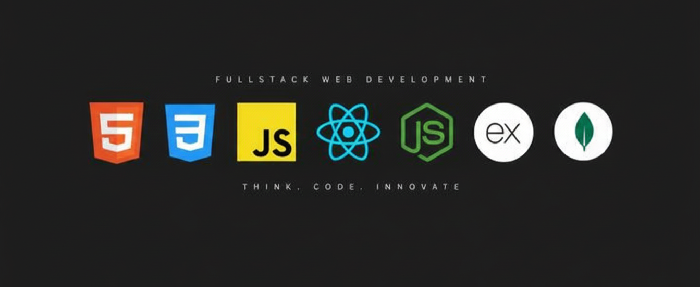

# 💫 About Me:
👋 Hi, I'm Rafiul Islam Jisan  💻 MERN Stack Web Developer 🔥 Passionate & Dedicated to building modern web applications  I’m a motivated web developer specializing in the MERN stack (MongoDB, Express.js, React.js, Node.js). I enjoy turning ideas into real-world, user-friendly applications and continuously improving my skills by learning new technologies and best practices.

## 🌐 Socials:
    

# 💻 Tech Stack:
            
# 📊 GitHub Stats:
 
 

### ✍️ Random Dev Quote

### 🔝 Top Contributed Repo

---

<!-- Proudly created with GPRM ( https://gprm.itsvg.in ) -->
